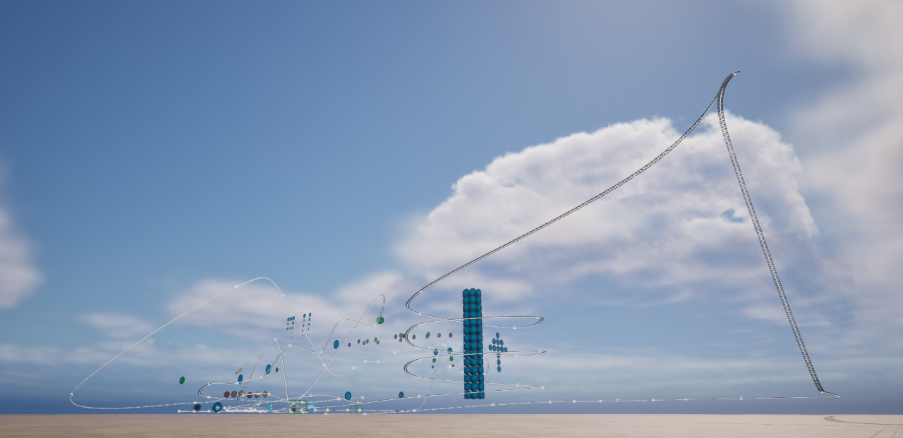

# Roller Coaster Shooting [[UE5 Petit CONTEST 22](https://historia.co.jp/ue5petitcon22)]

日本語バージョンは[こちら](./README.md)。  

  
This is a shooting game set in a roller coaster.  
Aim for a high score by shooting as many targets as possible within the time limit!  
This game had developed with Unreal Engine 5.  

## How to play

- Mouse move: Move the camera view
- Mouse click: Shoot the beam
- Esc: Exit the game

## Credit

### Image
- [roller-coaster-amusement-park](https://pixabay.com/vectors/roller-coaster-amusement-park-2069862/) by
  [GDJ](https://pixabay.com/users/gdj-1086657/)

### BGM / Jingle
- [OP/EDジングル30](https://dova-s.jp/bgm/play20075.html) by
  [t12ya](https://dova-s.jp/_contents/author/profile341.html)
- [Llevame al Paraiso](https://dova-s.jp/bgm/play15775.html) by
  [秦暁](https://dova-s.jp/_contents/author/profile430.html)

### Sound
- [3 2 1 GO!!! レースのスタート音](https://dova-s.jp/se/play1455.html) by
  [NaruIDEA](https://dova-s.jp/_contents/author/profile370.html)
- [ショット音](https://dova-s.jp/se/play674.html) by
  [Make a field Music](https://dova-s.jp/_contents/author/profile164.html)
- [飲み込まれる・吸い込まれる音](https://dova-s.jp/se/play579.html) by
  [ひふみセオリー](https://dova-s.jp/_contents/author/profile143.html)
- [アイテムゲット11,12,13,14](https://www.kirakira-soundeffect.com/soundeffect6.php) by
  [キラキラ効果音工房](https://www.kirakira-soundeffect.com/)
- [ゲームスタート音、ゲームスタート音2](https://www.kirakira-soundeffect.com/soundeffect8.php) by
  [キラキラ効果音工房](https://www.kirakira-soundeffect.com/)
